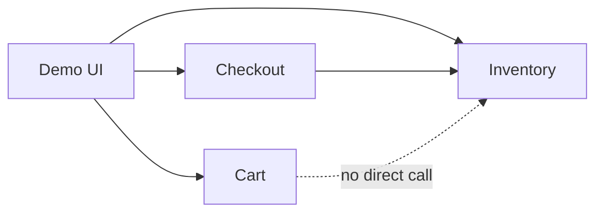

# Inter-Service API Contracts

Spec for wayfinder ticket [Define inter-service API contracts](https://github.com/DNBLabs/chaos-monkey/issues/5).

**Question:** REST endpoints, request/response shapes, and error semantics between cart, checkout, inventory, and the demo UI.

## Call topology



- **UI → Cart** — session cart CRUD
- **UI → Checkout** — start/retry checkout, poll status
- **UI → Inventory** — read Catalog, optional Stock read, demo Restock
- **Checkout → Inventory** — reserve / commit / release (internal; mesh-only)
- **Cart never calls Inventory** — stock validation deferred to checkout reserve

## Conventions

- **Base path:** `/api/v1/` on all services
- **Format:** JSON request/response bodies; `Content-Type: application/json`
- **Cart identity:** server-issued UUID in path (`/carts/{cartId}`); UI stores in `localStorage`
- **Correlation headers** (all requests):
  - `X-Request-Id: <uuid>` — client-generated per user action; echoed in response; logged by all services
  - `traceparent: <w3c>` — propagated through mesh hops (Istio/Envoy injects; apps pass through)

### Error envelope

All services return errors in this shape:

```json
{
  "error": {
    "code": "INSUFFICIENT_STOCK",
    "message": "Not enough stock for SKU-001",
    "details": { "sku": "SKU-001", "requested": 5, "available": 2 }
  }
}
```

| HTTP | Use |
|------|-----|
| `400` | Validation (`INVALID_QUANTITY`, malformed body) |
| `404` | Missing resource (`CART_NOT_FOUND`, `CHECKOUT_NOT_FOUND`) |
| `409` | Business conflict (`INSUFFICIENT_STOCK`, `RESERVATION_EXPIRED`, `COMMIT_FAILED`, `IDEMPOTENCY_KEY_REUSED`) |
| `422` | Checkout terminal failure surfaced to UI |
| `503` | Upstream unavailable (`INVENTORY_UNAVAILABLE`) |
| `500` | Unexpected |

Domain failure codes from the glossary apply where relevant: `INSUFFICIENT_STOCK`, `RESERVATION_EXPIRED`, `INVENTORY_UNAVAILABLE`, `PAYMENT_FAILED`, `COMMIT_FAILED`.

---

## Cart service

| Method | Path | Description |
|--------|------|-------------|
| `POST` | `/api/v1/carts` | Create empty cart |
| `GET` | `/api/v1/carts/{cartId}` | Get cart snapshot |
| `PUT` | `/api/v1/carts/{cartId}/items/{sku}` | Upsert line item |
| `DELETE` | `/api/v1/carts/{cartId}/items/{sku}` | Remove line item |

### Create cart

```
POST /api/v1/carts
→ 201 { "cartId": "<uuid>", "items": [] }
```

### Get cart

```
GET /api/v1/carts/{cartId}
→ 200 {
  "cartId": "<uuid>",
  "items": [
    { "sku": "...", "name": "...", "price": 12.99, "imageUrl": "...", "quantity": 2, "lineTotal": 25.98 }
  ]
}
→ 404 CART_NOT_FOUND
```

### Upsert line item

UI sends catalog snapshot fields (Cart does not call Inventory to validate):

```
PUT /api/v1/carts/{cartId}/items/{sku}
Body: { "quantity": 2, "name": "...", "price": 12.99, "imageUrl": "..." }
→ 200 { cartId, items: [...] }   # full cart snapshot
→ 400 INVALID_QUANTITY           # quantity <= 0; use DELETE to remove
→ 404 CART_NOT_FOUND
```

### Remove line item

```
DELETE /api/v1/carts/{cartId}/items/{sku}
→ 200 { cartId, items: [...] }
→ 404 CART_NOT_FOUND
```

---

## Checkout service

| Method | Path | Description |
|--------|------|-------------|
| `POST` | `/api/v1/checkouts` | Start checkout (idempotent) |
| `GET` | `/api/v1/checkouts/{checkoutId}` | Poll checkout status |

### Start checkout

```
POST /api/v1/checkouts
Headers: Idempotency-Key: <uuid>
Body:    { "cartId": "<uuid>" }

→ 201 Created (first attempt)
→ 200 OK (replay: same key + same cartId)
→ 409 IDEMPOTENCY_KEY_REUSED (same key + different cartId)
Body: {
  "checkoutId": "<uuid>",
  "status": "RESERVING" | "PAYMENT_PENDING" | "COMMITTING" | "COMPLETED" | "FAILED",
  "failureReason": "INSUFFICIENT_STOCK" | "RESERVATION_EXPIRED" | "INVENTORY_UNAVAILABLE" | "PAYMENT_FAILED" | "COMMIT_FAILED" | null,
  "orderId": "<uuid> | null
}
```

- One `Idempotency-Key` per deliberate Pay action; retries reuse key; new Pay click gets new key
- Checkout stores `(idempotencyKey → checkoutId, cartId)` on first create

### Poll checkout

```
GET /api/v1/checkouts/{checkoutId}
→ 200 { same body shape as POST response }
→ 404 CHECKOUT_NOT_FOUND
```

UI polls until `status` is `COMPLETED` or `FAILED`.

---

## Inventory service — public

| Method | Path | Description |
|--------|------|-------------|
| `GET` | `/api/v1/catalog` | Seeded product list |
| `GET` | `/api/v1/stock/{sku}` | Stock levels (demo observability) |
| `POST` | `/api/v1/demo/restock` | Reset all SKUs to seed levels |

### Catalog

```
GET /api/v1/catalog
→ 200 {
  "products": [
    { "sku": "...", "name": "...", "price": 12.99, "imageUrl": "..." }
  ]
}
```

Fixed seed set; no pagination.

### Stock read

```
GET /api/v1/stock/{sku}
→ 200 { "sku": "...", "available": 42, "reserved": 3 }
→ 404 SKU_NOT_FOUND
```

Optional for demo UI — shows live stock during chaos experiments.

### Demo restock

```
POST /api/v1/demo/restock
→ 200 { "restocked": true, "skus": ["SKU-001", "SKU-002", ...] }
```

Idempotent; resets entire catalog seed. Not shopper-facing.

---

## Inventory service — internal (mesh-only)

Prefix `/api/v1/internal/` — not exposed via Istio ingress.

| Method | Path | Description |
|--------|------|-------------|
| `POST` | `/api/v1/internal/reservations` | Reserve stock for checkout |
| `POST` | `/api/v1/internal/reservations/{checkoutId}/commit` | Commit reservation |
| `DELETE` | `/api/v1/internal/reservations/{checkoutId}` | Release reservation |

### Reserve

```
POST /api/v1/internal/reservations
Body: {
  "checkoutId": "<uuid>",
  "lines": [{ "sku": "...", "quantity": 2 }]
}
→ 201 { "reservationId": "<uuid>", "expiresAt": "..." }
→ 409 INSUFFICIENT_STOCK { details: { sku, requested, available } }
→ 503 INVENTORY_UNAVAILABLE
```

- All-or-nothing across lines; partial failure creates no reservation
- Keyed by `checkoutId`; replays return existing reservation (no double-hold)

### Commit

```
POST /api/v1/internal/reservations/{checkoutId}/commit
→ 200 { "committed": true }
→ 409 RESERVATION_EXPIRED | COMMIT_FAILED
→ 503 INVENTORY_UNAVAILABLE
```

Idempotent — replay returns `200`.

### Release

```
DELETE /api/v1/internal/reservations/{checkoutId}
→ 204 No Content
```

Idempotent — safe on every `FAILED` checkout path.
