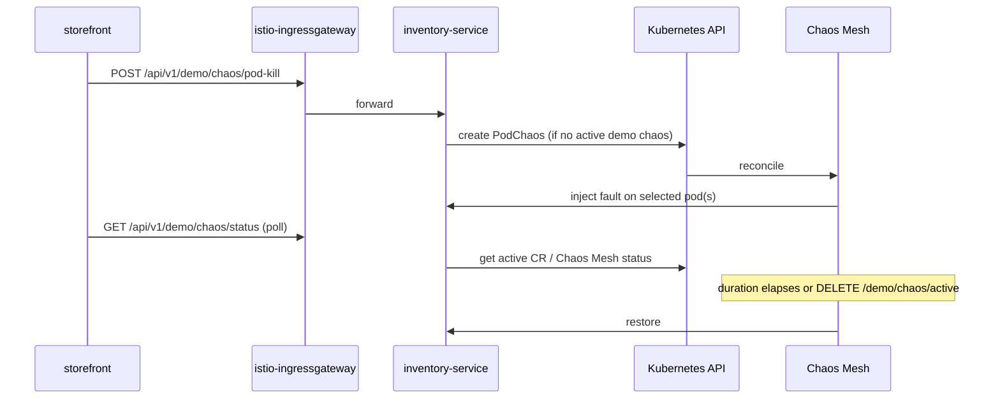

# Chaos Mesh Experiments and Demo UI Trigger

Spec for wayfinder ticket [Define Chaos Mesh experiments and UI trigger wiring](https://github.com/DNBLabs/chaos-monkey/issues/8).

**Question:** What Chaos Mesh CRDs/workflows implement the three inventory experiments (pod kill, network latency, CPU stress), and how does the demo UI trigger them safely on demand?

## Overview

Three **one-shot** Chaos Mesh experiments target **inventory-service pods only** via label selector `app: inventory-service` + `chaos-target: "true"`. No `Schedule` objects — each run is on-demand from the demo UI.

**Trigger path:** Storefront → Istio ingress → **inventory-service** demo API → Kubernetes API → Chaos Mesh CR in `chaos-monkey` namespace.

Chaos Dashboard stays operator-only (`kubectl port-forward`); shoppers never touch it.



---

## Experiment catalog

| Demo ID | CRD kind | Chaos Mesh action | Primary resilience story | Default duration |
|---------|----------|-------------------|--------------------------|------------------|
| `pod-kill` | `PodChaos` | `pod-kill` | Istio retries + `minReplicas: 2` | one-shot (no `duration`) |
| `network-latency` | `NetworkChaos` | `delay` | Istio timeouts/retries + checkout backoff | `90s` |
| `cpu-stress` | `StressChaos` | CPU stressors | HPA scale-out at 70% CPU | `120s` |

Pinned Chaos Mesh version: **2.8.3** ([local dev research](../research/local-k8s-dev-stack.md)).

---

## Shared selector (all experiments)

```yaml
selector:
  namespaces:
    - chaos-monkey
  labelSelectors:
    app: inventory-service
    chaos-target: "true"
  podPhaseSelectors:
    - Running
```

Cart, checkout, storefront, Redis, and Postgres never carry `chaos-target` — selector cannot reach them.

---

## CRD templates

CRs live in namespace **`chaos-monkey`** (per [deployment topology](deployment-topology.md)). Fixed metadata names allow idempotent replace.

### 1. Pod kill

Kills **one** random inventory pod. Deployment + HPA recreate it; surviving replica serves traffic during recovery.

```yaml
apiVersion: chaos-mesh.org/v1alpha1
kind: PodChaos
metadata:
  name: demo-pod-kill
  namespace: chaos-monkey
  labels:
    chaos-monkey/demo: "true"
    chaos-monkey/experiment: pod-kill
spec:
  action: pod-kill
  mode: one
  selector:
    namespaces:
      - chaos-monkey
    labelSelectors:
      app: inventory-service
      chaos-target: "true"
    podPhaseSelectors:
      - Running
```

- No `duration` — single kill event; fault restores when pod restarts ([PodChaos docs](https://chaos-mesh.org/docs/simulate-pod-chaos-on-kubernetes/)).
- Requires Deployment + HPA (`minReplicas: 2`) so one peer remains ([resilience spec](resilience.md)).

### 2. Network latency

Adds latency on inventory pod network. `mode: all` so every replica is slow — visible during checkout.

```yaml
apiVersion: chaos-mesh.org/v1alpha1
kind: NetworkChaos
metadata:
  name: demo-network-latency
  namespace: chaos-monkey
  labels:
    chaos-monkey/demo: "true"
    chaos-monkey/experiment: network-latency
spec:
  action: delay
  mode: all
  selector:
    namespaces:
      - chaos-monkey
    labelSelectors:
      app: inventory-service
      chaos-target: "true"
    podPhaseSelectors:
      - Running
  delay:
    latency: 400ms
    correlation: "25"
    jitter: 100ms
  duration: 90s
```

- `400ms` latency keeps checkout inside Istio `8s` route timeout + 3 retries under typical conditions ([resilience spec](resilience.md)).
- Auto-restores after `90s` ([one-time experiments](https://chaos-mesh.org/docs/run-a-chaos-experiment/)).

### 3. CPU stress

Drives CPU high to trigger HPA (`targetCPUUtilization: 70%`).

```yaml
apiVersion: chaos-mesh.org/v1alpha1
kind: StressChaos
metadata:
  name: demo-cpu-stress
  namespace: chaos-monkey
  labels:
    chaos-monkey/demo: "true"
    chaos-monkey/experiment: cpu-stress
spec:
  mode: all
  selector:
    namespaces:
      - chaos-monkey
    labelSelectors:
      app: inventory-service
      chaos-target: "true"
    podPhaseSelectors:
      - Running
  stressors:
    cpu:
      workers: 2
      load: 80
  duration: 120s
```

- `workers: 2`, `load: 80` → up to 160% CPU load per targeted container before cgroup cap ([StressChaos docs](https://chaos-mesh.org/docs/simulate-heavy-stress-on-kubernetes/)).
- `mode: all` stresses every inventory replica — HPA sees sustained pressure.
- Auto-restores after `120s`.

---

## Demo API (inventory-service)

Extends existing `/api/v1/demo/*` surface ([API contracts](api-contracts.md)). All routes are **demo-operator** actions (same trust level as `POST /demo/restock`).

### Start experiment

```
POST /api/v1/demo/chaos/{experiment}
```

| Path param | Maps to CR name |
|------------|-----------------|
| `pod-kill` | `demo-pod-kill` |
| `network-latency` | `demo-network-latency` |
| `cpu-stress` | `demo-cpu-stress` |

```
→ 202 Accepted {
  "experiment": "pod-kill",
  "status": "running",
  "startedAt": "2026-07-13T16:00:00Z",
  "endsAt": null          // null for pod-kill (one-shot)
}
→ 409 CHAOS_ALREADY_ACTIVE { "activeExperiment": "network-latency" }
→ 400 INVALID_EXPERIMENT
→ 503 CHAOS_UNAVAILABLE   // K8s API or Chaos Mesh unreachable
```

### Poll status

```
GET /api/v1/demo/chaos/status
→ 200 {
  "active": true,
  "experiment": "cpu-stress",
  "phase": "running" | "injecting" | "restoring" | "finished",
  "startedAt": "...",
  "endsAt": "..."
}
→ 200 { "active": false }
```

`phase` derived from Chaos Mesh CR `.status` conditions when available; fall back to presence/absence of labeled CR.

### Stop early

```
DELETE /api/v1/demo/chaos/active
→ 204 No Content
→ 404 NO_ACTIVE_CHAOS
```

Deletes the active demo CR; Chaos Mesh restores faults immediately ([delete restores injected faults](https://chaos-mesh.org/docs/run-a-chaos-experiment/)).

---

## Safety rules

| Rule | Implementation |
|------|----------------|
| **Single active demo chaos** | Before `create`, list CRs with label `chaos-monkey/demo=true`; reject if any exists (`409 CHAOS_ALREADY_ACTIVE`). |
| **Fixed experiment set** | Only three path params; no arbitrary YAML from UI. |
| **Scoped blast radius** | Selector locked in server-side templates; UI cannot override labels/namespaces. |
| **Time-bounded faults** | `duration` on NetworkChaos and StressChaos; pod-kill is inherently brief. |
| **No schedules** | Inventory never creates `Schedule` CRs. |
| **Idempotent start** | If same experiment CR exists and is still active, return `200` with current status (not a second kill). |
| **Cleanup on stop** | `DELETE` removes CR; use `chaos-mesh.chaos-mesh.org/cleanFinalizer=forced` annotation only as operator escape hatch. |
| **Restock between demos** | UI should call `POST /demo/restock` before a new checkout run; not enforced by chaos API. |

**Concurrency with checkout:** Demo script starts chaos **before** shopper clicks Pay. Experiments are short (&lt; 2 min per [resilience spec](resilience.md)); reservation TTL (5 min) unchanged.

**Istio vs Chaos Mesh:** Istio handles L7 retries/timeouts; Chaos Mesh handles infra faults — complementary layers ([local dev research](../research/local-k8s-dev-stack.md)).

---

## RBAC

Grant **inventory-service** ServiceAccount permission to manage only the three chaos kinds in `chaos-monkey`:

```yaml
apiVersion: v1
kind: ServiceAccount
metadata:
  name: inventory-service
  namespace: chaos-monkey
---
apiVersion: rbac.authorization.k8s.io/v1
kind: Role
metadata:
  name: inventory-chaos-demo
  namespace: chaos-monkey
rules:
  - apiGroups: ["chaos-mesh.org"]
    resources: ["podchaos", "networkchaos", "stresschaos"]
    verbs: ["get", "list", "watch", "create", "delete"]
  - apiGroups: [""]
    resources: ["pods"]
    verbs: ["get", "list", "watch"]
---
apiVersion: rbac.authorization.k8s.io/v1
kind: RoleBinding
metadata:
  name: inventory-chaos-demo
  namespace: chaos-monkey
subjects:
  - kind: ServiceAccount
    name: inventory-service
    namespace: chaos-monkey
roleRef:
  apiGroup: rbac.authorization.k8s.io
  kind: Role
  name: inventory-chaos-demo
```

Inventory uses in-cluster config (`kubernetes` Python client or `@kubernetes/client-node`). No Chaos Dashboard token in the app.

Chaos Mesh controllers remain in `chaos-mesh` namespace; dashboard auth stays disabled locally (`dashboard.securityMode=false` acceptable for kind only) or operator-token on AKS.

---

## Implementation notes

| Area | Choice |
|------|--------|
| **Template storage** | Embed YAML templates in inventory-service; substitute only `metadata.name` / timestamps — no user-controlled fields. |
| **CR watch** | Optional informer for status polling; acceptable to poll `get` every 2s from UI via inventory. |
| **AKS ingress** | Chaos API exposed via existing `/api/v1/demo/*` path on inventory VirtualService — no separate `/chaos` ingress to Chaos Dashboard. |
| **Observability** | Log `experiment`, `X-Request-Id`, CR UID on start/stop; Jaeger shows retry hops during network-latency and pod-kill. |

---

## Per-experiment demo script (expected UX)

| Step | Action |
|------|--------|
| 1 | `POST /demo/restock` |
| 2 | `POST /demo/chaos/{experiment}` |
| 3 | Shopper adds items, clicks Pay |
| 4 | UI polls checkout + optional `GET /demo/chaos/status` |
| 5 | Observe delay/recovery in UI and Jaeger |
| 6 | Wait for auto-restore or `DELETE /demo/chaos/active` |

Aligns with per-experiment behavior in [resilience spec](resilience.md).

---

## Deferred

| Area | Owner ticket |
|------|--------------|
| Storefront chaos control panel layout | [#9](https://github.com/DNBLabs/chaos-monkey/issues/9) |
| `api-contracts.md` formal addition of chaos endpoints | implementation / follow-up edit when building inventory |
| GitOps packaging of static CR templates | CI/CD ticket (fog) |

---

## Decision summary

- **Three fixed CRD shapes** — `PodChaos` (pod-kill, mode one), `NetworkChaos` (delay 400ms, 90s), `StressChaos` (CPU 2×80%, 120s).
- **inventory-service** triggers CR create/delete via scoped RBAC; no Dashboard in shopper path.
- **Mutex** via `chaos-monkey/demo=true` label + `409` on overlap.
- **Selectors** hard-coded to `inventory-service` + `chaos-target: "true"` in `chaos-monkey` namespace.
- **Demo API** — `POST /demo/chaos/{experiment}`, `GET /demo/chaos/status`, `DELETE /demo/chaos/active`.

## Sources

- [Chaos Mesh PodChaos](https://chaos-mesh.org/docs/simulate-pod-chaos-on-kubernetes/)
- [Chaos Mesh NetworkChaos](https://chaos-mesh.org/docs/simulate-network-chaos-on-kubernetes/)
- [Chaos Mesh StressChaos](https://chaos-mesh.org/docs/simulate-heavy-stress-on-kubernetes/)
- [Run a Chaos Experiment](https://chaos-mesh.org/docs/run-a-chaos-experiment/)
- [Define experiment scope](https://chaos-mesh.org/docs/define-chaos-experiment-scope/)
- [Manage user permissions](https://chaos-mesh.org/docs/manage-user-permissions/)
