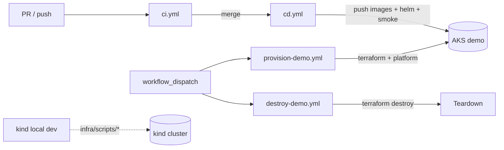

# CI/CD Pipeline

Spec for wayfinder ticket [Define CI/CD pipeline scope](https://github.com/DNBLabs/chaos-monkey/issues/10).

**Question:** What CI/CD pipeline scope fits this sandbox — build/test/deploy for kind and AKS — and should chaos experiments run in CI or stay manual demo-only?

## Decision

**GitHub Actions** with a four-workflow split: PR verification (`ci.yml`), post-merge deploy (`cd.yml`), infrastructure provision (`provision-demo.yml`), and teardown (`destroy-demo.yml`). **kind** stays local-only; **chaos experiments** stay manual demo-only — not CI, not smoke tests.

---

## Workflow overview



| Workflow | File | Trigger | Purpose |
|----------|------|---------|---------|
| CI | `.github/workflows/ci.yml` | PR + push `main` (path-filtered) | Lint, typecheck, unit tests, dependency audit, `docker build` verify — **no push, no deploy** |
| CD | `.github/workflows/cd.yml` | push `main` (path-filtered) | Build once → push ACR → `helm upgrade` → `smoke-test.sh` |
| Provision | `.github/workflows/provision-demo.yml` | `workflow_dispatch` + `infra/**` change on `main` | `terraform apply` + `platform-install.sh` — requires `demo` environment approval |
| Destroy | `.github/workflows/destroy-demo.yml` | `workflow_dispatch` only | `terraform destroy` — stop Azure spend |

---

## PR pipeline (`ci.yml`)

Parallel matrix — one job per build target per [repository layout](repository-layout.md):

| Target | Directory | Checks |
|--------|-----------|--------|
| `cart-service` | `services/cart-service/` | `npm ci` → lint → `tsc --noEmit` → unit tests → `docker build` |
| `checkout-service` | `services/checkout-service/` | same as cart |
| `storefront` | `apps/storefront/` | same as cart |
| `inventory-service` | `services/inventory-service/` | `pip install` → ruff lint → pytest → `docker build` |

**Dependency audit** on every PR job:

- TypeScript: `npm audit` — fail on **high** or **critical**
- Python: `pip-audit` — fail on **high** or **critical**

All four matrix jobs must pass to merge. No cross-service integration tests on PR — requires K8s/mesh; covered by post-deploy smoke in CD.

**Path filters** (skip when only docs change):

- `services/**`
- `apps/**`
- `.github/workflows/ci.yml`

**Concurrency:** `cancel-in-progress: true` per PR — latest commit wins.

---

## CD pipeline (`cd.yml`)

Runs on push to `main` after merge. **Build once, deploy same artifact.**

### Image registry and tags

| Piece | Choice |
|-------|--------|
| Registry | Azure Container Registry (ACR), provisioned in same Terraform stack as AKS |
| Tag pattern | `{acr}.azurecr.io/{service}:{git-sha}` — immutable, traceable |
| Images | `cart-service`, `checkout-service`, `inventory-service`, `storefront` |
| Helm | `values-aks.yaml` accepts full image refs; CI injects SHA at deploy time |

### Deploy steps

1. OIDC auth to Azure
2. Build and push four images tagged with `${{ github.sha }}`
3. `helm upgrade --install` via `infra/scripts/deploy-app.sh` with `values-aks.yaml`
4. Run `infra/scripts/smoke-test.sh` against ingress URL

**Path filters:**

- `services/**`
- `apps/**`
- `infra/k8s/**`
- `infra/scripts/deploy-app.sh`
- `infra/scripts/smoke-test.sh`
- `.github/workflows/cd.yml`

**Concurrency:** `group: demo-deploy`, `cancel-in-progress: false` — queue deploys; do not kill in-flight helm upgrade.

**Cluster absent:** if AKS not provisioned, `cd.yml` fails fast with message to run `provision-demo.yml` first.

---

## Provision pipeline (`provision-demo.yml`)

Creates or updates demo infrastructure. **Cost guard:** job uses GitHub Environment `demo` with **required reviewer** approval before `terraform apply` (Level A — approval only on infra provision, not every app deploy).

### Steps

1. OIDC auth to Azure (secrets scoped to `demo` environment)
2. `terraform apply` — AKS, ACR, supporting resources per [issue #3](https://github.com/DNBLabs/chaos-monkey/issues/3)
3. `infra/scripts/platform-install.sh` — metrics-server, Istio, Chaos Mesh (pinned versions)

**Auto-trigger on `main`** when paths change:

- `infra/terraform/**`
- `infra/scripts/platform-install.sh`
- `.github/workflows/provision-demo.yml`

Always available via `workflow_dispatch`.

**Cluster lifecycle:** cluster **stays up** between `main` merges for stable demo URL. App-only merges re-deploy via `cd.yml` (helm upgrade only). Destroy via manual `destroy-demo.yml`.

---

## Destroy pipeline (`destroy-demo.yml`)

`workflow_dispatch` only. Runs `terraform destroy` to tear down AKS + ACR and stop hourly node cost. No approval gate — destroying saves money.

---

## Post-deploy smoke tests

Lives in **CD only** — not PR CI. Implemented as `infra/scripts/smoke-test.sh`, callable locally against kind or from `cd.yml` against AKS ingress.

```bash
./infra/scripts/smoke-test.sh "${INGRESS_URL}"
```

| Check | Target |
|-------|--------|
| Ingress up | `GET /` → storefront 200 |
| Catalog | `GET /api/v1/catalog` → JSON product list |
| Cart flow | `POST /api/v1/carts` → session created |
| Checkout happy path | add item → `POST /api/v1/checkouts` with idempotency key → `COMPLETED` |
| Health | each service `/health` or `/ready` → 200 |

**Timeout:** ~5 minutes. Fail CD workflow if any step red.

**Explicitly out of smoke:**

- Chaos experiments — manual UI demo only
- HPA scale-under-load — manual chaos demo observation
- Payment failure paths — scenario tests, not deploy gate

---

## Chaos experiments in CI

**No.** Chaos stays manual, UI-triggered per [chaos-experiments spec](chaos-experiments.md) and [storefront UI spec](storefront-ui.md). Reasons:

- Non-deterministic — pod kill mid-check causes flaky CI
- Different test class — resilience demo vs deploy verification
- Side effects — active experiment degrades cluster for subsequent runs

Chaos narrative belongs in portfolio demo script (downstream ticket), not automated gates.

---

## kind and local dev

**Not in CI.** kind requires WSL2/Docker Desktop stack unsuitable for GitHub-hosted runners. Local dev uses same `infra/scripts/` as CD per [repository layout](repository-layout.md):

- `kind-up.sh` — local cluster
- `platform-install.sh` — Istio, Chaos Mesh
- `deploy-app.sh` — helm with `values-kind.yaml`
- `smoke-test.sh` — verify local deploy

---

## Secrets and authentication

| Config | Where | Used by |
|--------|-------|---------|
| OIDC federated credentials | GitHub Environment `demo` | provision, cd, destroy |
| Terraform remote state | Azure Storage backend in demo RG | all terraform workflows |
| Service principal scope | Contributor on demo resource group only | OIDC identity |

**Auth method:** OIDC federated identity (passwordless) — preferred over long-lived `AZURE_CREDENTIALS` JSON client secret.

**ACR:** push via OIDC identity with `AcrPush`; AKS pulls via ACR attach or kubelet managed identity — no registry password in Helm values.

**PR CI:** zero Azure secrets — no cluster access on pull requests.

---

## Branch protection (`main`)

| Rule | Setting |
|------|---------|
| Require pull request | yes |
| Required status checks | all four `ci.yml` matrix jobs |
| Require branches up to date | yes |
| Direct push to `main` | blocked |

CD is not a merge gate — runs after merge to `main`.

`docs/**`-only changes skip CI and CD (path filters).

---

## Rationale summary

| Choice | Why |
|--------|-----|
| CI/CD split | Shift-left fast PR feedback; deploy only proven artifacts |
| Four workflows | Cost guard isolates terraform approval from routine app deploys |
| ACR + git-sha tags | Immutable traceable images; build once promote same SHA |
| Shell smoke script | Same script local + CD; debug without re-running pipeline |
| Chaos out of CI | Flaky, non-deterministic, manual demo narrative |
| kind local only | GH runners lack kind stack; scripts mirror deploy path |
| OIDC + remote state | DevOps best practice; no rotating secrets; safe concurrent terraform |
