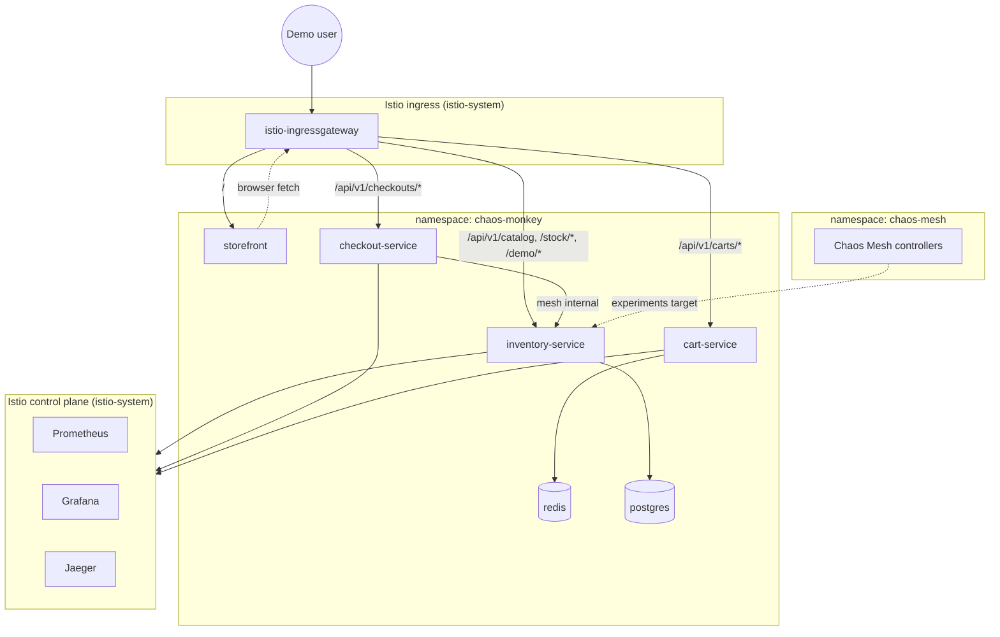
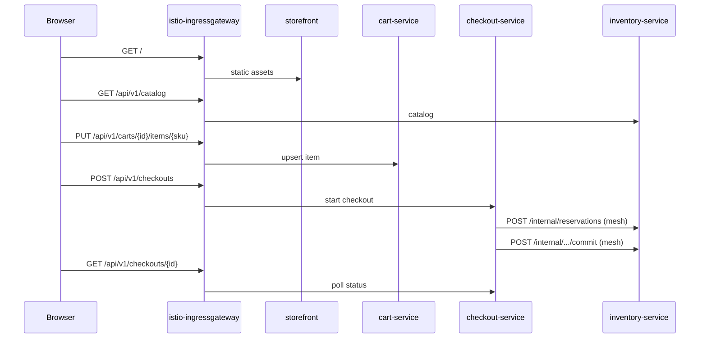

# Deployment Topology

Spec for wayfinder ticket [Design deployment topology](https://github.com/DNBLabs/chaos-monkey/issues/7).

**Question:** What does the Kubernetes deployment layout look like — namespaces, workloads, data stores, mesh ingress, and observability components — for both kind and the ephemeral managed demo cluster?

## Overview



One application namespace (`chaos-monkey`) holds all demo workloads and data stores. Platform components stay in their upstream namespaces (`istio-system`, `chaos-mesh`, `kube-system`).

---

## Namespaces

| Namespace | Contents | Sidecar injection |
|-----------|----------|-------------------|
| `istio-system` | istiod, ingress gateway, Prometheus, Grafana, Jaeger (Istio addons) | n/a |
| `chaos-mesh` | Chaos Mesh controller, dashboard, chaos-daemon | disabled |
| `chaos-monkey` | cart, checkout, inventory, storefront, redis, postgres | **enabled** (`istio-injection=enabled`) |
| `kube-system` | metrics-server (HPA prerequisite) | n/a |

No per-service namespaces — the sandbox is small; one app namespace keeps chaos RBAC and demo scripts simple.

---

## Workloads (`chaos-monkey`)

| Workload | Kind | Replicas | Notes |
|----------|------|----------|-------|
| `cart-service` | Deployment | **1** (fixed) | TypeScript; talks to Redis only |
| `checkout-service` | Deployment | **1** (fixed) | TypeScript; stateless; calls Inventory via mesh |
| `inventory-service` | Deployment + **HPA** | **2–4** | Python; `minReplicas: 2` per [resilience spec](resilience.md) |
| `storefront` | Deployment | **1** | React/Vite static build served by nginx |
| `redis` | Deployment | **1** | Cart session store; single instance sufficient |
| `postgres` | StatefulSet | **1** | Inventory persistence; not a chaos target |

**Services:** `ClusterIP` for every workload. Only `istio-ingressgateway` (in `istio-system`) is `LoadBalancer`.

**Ports:** all app containers listen on **8080**; storefront nginx on **80**.

**Probes:** HTTP `GET /healthz` on 8080 (apps) and `GET /` on 80 (storefront). Inventory HPA uses CPU from metrics-server.

### Data stores

| Store | Used by | Persistence |
|-------|---------|-------------|
| **Redis** | Cart | PVC on AKS; `emptyDir` acceptable on kind for throwaway local sessions |
| **Postgres** | Inventory | PVC required on both environments (catalog seed + stock survive pod restarts) |

Secrets:

- `postgres-credentials` — `DATABASE_URL` for inventory (`chaos-monkey` namespace)
- Redis — no auth for sandbox; connection string via env `REDIS_URL=redis://redis:6379`

Catalog seed loads via inventory migration/init container on first Postgres start.

---

## Mesh ingress and routing

### Gateway

Single Istio `Gateway` bound to `istio-ingressgateway`, port **80** (TLS deferred — portfolio demo on ephemeral cluster).

### VirtualService (path-based)

| Path prefix | Destination | Exposed |
|-------------|-------------|---------|
| `/api/v1/carts` | `cart-service:8080` | public |
| `/api/v1/checkouts` | `checkout-service:8080` | public |
| `/api/v1/catalog`, `/api/v1/stock`, `/api/v1/demo` | `inventory-service:8080` | public (demo endpoints only) |
| `/` | `storefront:80` | public |
| `/api/v1/internal/*` | — | **not routed** — mesh-only |

Checkout → Inventory uses cluster DNS (`inventory-service.chaos-monkey.svc.cluster.local`) on internal paths. No `VirtualService` exposes `/api/v1/internal/`.

### DestinationRule

`inventory-service` carries outlier detection and connection pool settings from [resilience spec](resilience.md). Cart and Checkout get default mesh policies only.

---

## Observability

Installed from Istio release **addons** into `istio-system` (see [local dev research](../research/local-k8s-dev-stack.md)):

| Component | Purpose | Access (local) | Access (AKS demo) |
|-----------|---------|----------------|-------------------|
| **Prometheus** | mesh + app metrics | `istioctl dashboard prometheus` | port-forward or ingress stub |
| **Grafana** | dashboards | `istioctl dashboard grafana` | same |
| **Jaeger** | distributed traces | `istioctl dashboard jaeger` | same |

**Tracing:** Istio generates trace IDs; apps propagate `traceparent` per [API contracts](api-contracts.md). Checkout → Inventory hop visible in Jaeger during chaos retries.

**App metrics:** optional Prometheus scrape annotations on inventory (HPA CPU is primary signal for chaos demo).

Observability stays in `istio-system` on both environments — no duplicate Prometheus in `chaos-monkey`.

---

## Chaos Mesh placement

| Component | Namespace | Notes |
|-----------|-----------|-------|
| Chaos Mesh Helm release | `chaos-mesh` | controller + daemon; containerd socket on kind |
| Experiment CRs | `chaos-monkey` | target `inventory-service` pods only |
| Dashboard | `chaos-mesh` | `kubectl port-forward` locally; optional ingress path `/chaos` on AKS (ticket [#8](https://github.com/DNBLabs/chaos-monkey/issues/8) decides UI trigger wiring) |

Chaos Mesh does **not** share the app namespace. RBAC grants a future demo trigger service permission to create/delete `PodChaos`, `NetworkChaos`, `StressChaos` in `chaos-monkey`.

---

## Environment matrix

### kind (local dev)

| Aspect | Choice |
|--------|--------|
| Cluster | Single control-plane node (`kind-chaos-monkey`) |
| Kubernetes | `kindest/node:v1.36.1` (pinned) |
| Istio profile | **`demo`** — reduced resources |
| LoadBalancer | **cloud-provider-kind** → `istio-ingressgateway` external IP |
| Images | `docker build` + `kind load docker-image` |
| Nodes for HPA | Single node runs multiple inventory replicas (scheduling still works; not topology-faithful) |
| Postgres/Redis storage | Postgres PVC via default kind `local-path`; Redis `emptyDir` OK |

Access storefront: `http://<LB-IP>/` or port-forward ingress gateway.

### AKS (ephemeral portfolio demo)

| Aspect | Choice |
|--------|--------|
| Provision | Terraform `azurerm` — apply before demo, destroy after |
| Node pool | **2 nodes**, smallest on-demand SKU; `var.location` defaults to website region |
| Istio profile | **`default`** (or slim custom) — not `demo`; AKS has real resources |
| LoadBalancer | Azure LB on `istio-ingressgateway` (native) |
| Images | Build → push to **ACR** → pull by cluster |
| HPA fidelity | 2 nodes let pod-kill chaos + `minReplicas: 2` behave realistically |
| Postgres/Redis storage | Azure Disk PVCs; retain policy **Delete** on destroy |

**Cost guard:** cluster exists only during demo window; no always-on node pools.

---

## Request path (happy path)



---

## Labels and selectors (chaos targeting)

Inventory pods carry consistent labels for Chaos Mesh selectors:

```yaml
app: inventory-service
version: v1
chaos-target: "true"   # experiments select on this
```

Cart and Checkout omit `chaos-target` — experiments never target them.

---

## Install order (both environments)

1. Cluster ready (kind create **or** `terraform apply`)
2. metrics-server → `kube-system`
3. Istio control plane + ingress gateway → `istio-system`
4. Istio observability addons → `istio-system`
5. Chaos Mesh → `chaos-mesh` (containerd settings on kind)
6. Create `chaos-monkey` namespace + injection label
7. Deploy Postgres → Redis → inventory → cart → checkout → storefront
8. Apply Gateway + VirtualService + DestinationRule + HPA

---

## Deferred to downstream tickets

| Area | Ticket |
|------|--------|
| Chaos Mesh CRD shapes + demo UI trigger | [#8](https://github.com/DNBLabs/chaos-monkey/issues/8) |
| Storefront screens and status surfaces | [#9](https://github.com/DNBLabs/chaos-monkey/issues/9) |
| Terraform module layout for AKS | CI/CD / repo-layout ticket (fog) |
| ACR naming and image tags | CI/CD ticket (fog) |

---

## Decision summary

- **One app namespace** (`chaos-monkey`) with Istio injection; platform stacks stay separate.
- **Path-based ingress** through a single Istio gateway; internal inventory APIs mesh-only.
- **Fixed replicas** for cart, checkout, storefront; **HPA on inventory only**.
- **Redis + Postgres in-cluster** — no managed Azure Cache/DB (cost + simplicity).
- **kind** uses `demo` profile + cloud-provider-kind; **AKS** uses 2-node ephemeral cluster + native LB + ACR.
- **Observability** in `istio-system` via Istio addons on both environments.
