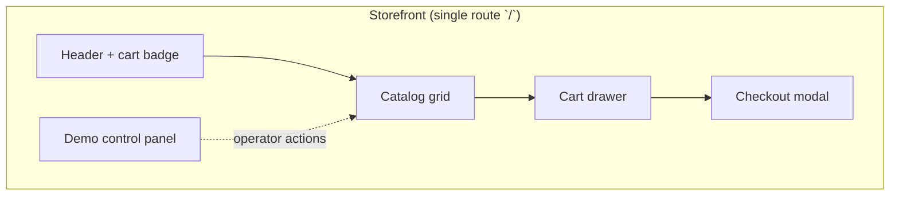

# Demo Storefront UI Flows

Spec for wayfinder ticket [Design demo storefront UI flows](https://github.com/DNBLabs/chaos-monkey/issues/9).

**Question:** What screens, user flows, and live status surfaces does the thin React/Vite storefront need to demonstrate a successful checkout during on-demand chaos?

## Overview

Single-page React/Vite app served as static assets from nginx ([deployment topology](deployment-topology.md)). No client-side router — one view with three regions:



| Region | Purpose | Shopper-facing |
|--------|---------|----------------|
| **Header** | Brand, cart item count, open-cart affordance | yes |
| **Catalog grid** | Browse seeded products, add to cart | yes |
| **Cart drawer** | Line items, totals, Pay | yes |
| **Checkout modal** | In-flight status, outcome, retry | yes |
| **Demo control panel** | Restock, chaos triggers, observability toggles | no (labeled operator strip) |

Browser calls ingress paths directly (`/api/v1/...`) — same origin via Istio gateway.

---

## Session bootstrap

On first load:

1. Read `cartId` from `localStorage` key `chaos-monkey:cartId`.
2. If missing → `POST /api/v1/carts` → persist returned `cartId`.
3. If present → `GET /api/v1/carts/{cartId}`; on `404 CART_NOT_FOUND` → create new cart.
4. `GET /api/v1/catalog` → render product grid.

No auth. Cart identity is the server-issued UUID only.

---

## Catalog grid

Each product card shows:

| Field | Source |
|-------|--------|
| Image, name, price | `GET /api/v1/catalog` |
| **Add to cart** | `PUT /api/v1/carts/{cartId}/items/{sku}` with catalog snapshot fields |
| **Stock badge** (optional) | `GET /api/v1/stock/{sku}` when observability toggle on |

**Add to cart:** quantity defaults to `1`; repeated clicks increment by 1. Each action sends `X-Request-Id: <uuid>` ([API contracts](api-contracts.md)).

**Stock badge** (demo observability, off by default): shows `available` / `reserved` from inventory. Poll every **5s** while toggle on and panel visible. Not shown to shopper when toggle off — keeps default UX clean.

---

## Cart drawer

Slide-over from right; opens from header cart badge or after add-to-cart.

| Element | Behavior |
|---------|----------|
| Line items | sku, name, qty, line total; **Remove** → `DELETE .../items/{sku}` |
| Subtotal | sum of `lineTotal` |
| **Pay** | starts checkout (see below) |
| Empty state | "Cart is empty" + link to close drawer |

Cart drawer stays open when Pay is clicked — checkout modal layers on top.

---

## Checkout flow (shopper)

### Start

Pay click:

1. Generate `idempotencyKey = crypto.randomUUID()` — **one key per deliberate Pay click**.
2. `POST /api/v1/checkouts` with header `Idempotency-Key` and body `{ cartId }`.
3. Open **checkout modal** with returned `checkoutId` and initial `status`.
4. Disable Pay until modal closes.

### Poll

`GET /api/v1/checkouts/{checkoutId}` until terminal:

| Phase | Interval |
|-------|----------|
| First 10s elapsed | **1s** |
| After 10s | **2s** |

Per [resilience spec](resilience.md). Stop on `COMPLETED` or `FAILED`.

### Modal content

**In-flight** — status stepper:

```
RESERVING → PAYMENT_PENDING → COMMITTING → COMPLETED
```

Highlight current step; prior steps checked. Show **elapsed seconds** since Pay.

**Success** (`COMPLETED`):

- Order confirmation with `orderId`
- **Done** closes modal; clears cart client-side after `GET` cart (server should be empty or UI refetches cart)
- Display last `X-Request-Id` (copy button) for Jaeger lookup

**Failure** (`FAILED`):

- Prominent `failureReason` mapped to human copy:

| Code | UI message |
|------|------------|
| `INSUFFICIENT_STOCK` | Not enough stock — try restock (demo) or reduce quantity |
| `INVENTORY_UNAVAILABLE` | Inventory temporarily unavailable — retries exhausted |
| `RESERVATION_EXPIRED` | Reservation timed out during delay — try Pay again |
| `PAYMENT_FAILED` | Payment step failed (demo stub) |
| `COMMIT_FAILED` | Could not commit reservation |

- Cart preserved (drawer still has items)
- **Try again** closes modal; next Pay uses **new** `Idempotency-Key`
- Last `X-Request-Id` shown (copy button)

No automatic retry — user must click Pay again.

---

## Demo control panel

Fixed **bottom strip** (collapsible to a tab labeled **Demo Controls**). Clearly separated visually from catalog (muted background, monospace accents). Not hidden — portfolio audience sees operator tools.

### Controls

| Control | API | Enabled when |
|---------|-----|--------------|
| **Restock all** | `POST /api/v1/demo/restock` | always |
| **Pod kill** | `POST /api/v1/demo/chaos/pod-kill` | no active chaos |
| **Network latency** | `POST /api/v1/demo/chaos/network-latency` | no active chaos |
| **CPU stress** | `POST /api/v1/demo/chaos/cpu-stress` | no active chaos |
| **Stop chaos** | `DELETE /api/v1/demo/chaos/active` | active chaos |
| **Show stock levels** | toggles catalog stock badges | always |

After **Restock**: toast "Stock reset"; refresh stock badges if toggle on.

After **Start chaos**: poll `GET /api/v1/demo/chaos/status` every **2s** until `active: false` ([chaos experiments](chaos-experiments.md)).

On `409 CHAOS_ALREADY_ACTIVE`: show which experiment is running; refresh status poll.

### Chaos status surface

When `active: true`, show inline in demo strip:

| Field | Source |
|-------|--------|
| Experiment name | `experiment` |
| Phase | `phase` (`running`, `injecting`, `restoring`, `finished`) |
| Countdown | `endsAt` minus now (pod-kill shows "one-shot" — no countdown) |
| **Stop** button | `DELETE /demo/chaos/active` |

Global **chaos active pill** in header (amber): experiment id — visible even when demo strip collapsed.

---

## Recommended demo script (operator + shopper)

Aligns with [chaos experiments demo script](chaos-experiments.md):

| Step | Who | Action |
|------|-----|--------|
| 1 | Operator | **Restock all** |
| 2 | Operator | Start one chaos experiment |
| 3 | Shopper | Add items to cart |
| 4 | Shopper | **Pay** — watch checkout modal delay/stepper |
| 5 | Both | Observe header chaos pill + checkout elapsed time; copy `X-Request-Id` → Jaeger |
| 6 | Operator | Wait for auto-restore or **Stop chaos** |
| 7 | Shopper | On failure → **Try again** (new Pay) after chaos clears |

Toggle **Show stock levels** during CPU stress to watch `reserved` change mid-checkout.

---

## Client state model

```typescript
// In-memory React state (no persistence beyond cartId)
type AppState = {
  cartId: string;
  catalog: Product[];
  cart: Cart | null;
  cartDrawerOpen: boolean;
  checkout: {
    checkoutId: string;
    status: CheckoutStatus;
    failureReason: string | null;
    orderId: string | null;
    startedAt: number;
    lastRequestId: string;
  } | null;
  chaos: {
    active: boolean;
    experiment: string | null;
    phase: string | null;
    endsAt: string | null;
  };
  showStockLevels: boolean;
  stockBySku: Record<string, { available: number; reserved: number }>;
};
```

**Request helper:** every `fetch` adds `X-Request-Id`; store last id on checkout actions for display.

---

## Layout sketch

```
┌─────────────────────────────────────────────────────────────┐
│ Chaos Monkey Shop          [chaos: cpu-stress ●]    Cart (3) │
├─────────────────────────────────────────────────────────────┤
│                                                             │
│   ┌─────────┐  ┌─────────┐  ┌─────────┐                      │
│   │ SKU-001 │  │ SKU-002 │  │ SKU-003 │   ...                │
│   │ $12.99  │  │  $8.50  │  │ $24.00  │                      │
│   │ avail:42│  │         │  │ avail:7 │  ← stock if toggled  │
│   │[Add]    │  │[Add]    │  │[Add]    │                      │
│   └─────────┘  └─────────┘  └─────────┘                      │
│                                                             │
├─────────────────────────────────────────────────────────────┤
│ ▲ Demo Controls                                             │
│ [Restock] [Pod kill] [Net latency] [CPU stress] [Stop]      │
│ Active: network-latency · running · 0:42 remaining          │
│ [ ] Show stock levels                                       │
└─────────────────────────────────────────────────────────────┘

Cart drawer (right):                Checkout modal (center):
┌──────────────────────┐           ┌──────────────────────────┐
│ Your cart            │           │ Processing checkout…     │
│ SKU-001 x2    $25.98 │           │ ● RESERVING              │
│ SKU-003 x1    $24.00 │           │ ○ PAYMENT_PENDING        │
│ ─────────────────    │           │ ○ COMMITTING             │
│ Total      $49.98    │           │ Elapsed: 4s              │
│ [ Pay ]              │           │ req: a1b2…  [copy]       │
└──────────────────────┘           └──────────────────────────┘
```

---

## Non-goals (this UI)

| Excluded | Why |
|----------|-----|
| Product search / pagination | Fixed seed catalog |
| Account / login | Out of scope |
| Automatic load generator | Manual UI actions only ([map fog](https://github.com/DNBLabs/chaos-monkey/issues/1)) |
| Chaos Dashboard embed | Operator uses `kubectl port-forward` ([chaos experiments](chaos-experiments.md)) |
| Multi-tab cart sync | Single browser session demo |

---

## Implementation notes

| Area | Choice |
|------|--------|
| **Stack** | React 19 + Vite; TypeScript; minimal CSS (no component library required) |
| **API base** | Relative `/api/v1` — works behind Istio ingress on kind and AKS |
| **Errors** | Parse `error.code` from envelope; generic fallback toast |
| **Loading** | Disable triggering buttons during in-flight requests |
| **Accessibility** | Modal focus trap; stepper `aria-current` on active step |

---

## Decision summary

- **Single-page**, no router — catalog + cart drawer + checkout modal + collapsible demo strip.
- **Shopper path:** bootstrap cart → catalog add → Pay → poll checkout modal → success or manual retry.
- **Operator path:** restock → start one chaos experiment → poll chaos status → optional stop.
- **Live surfaces:** checkout stepper + elapsed time, chaos pill + countdown, optional per-SKU stock badges, copyable `X-Request-Id`.
- **Polling:** checkout 1s/2s; chaos status 2s when active; stock 5s when toggle on.
- **Demo script** documented for portfolio walkthrough with Jaeger correlation.

## Deferred

| Area | Owner |
|------|-------|
| Formal chaos endpoints in `api-contracts.md` | implementation |
| Portfolio README / recorded demo script | fog ticket on map |
| Synthetic load generation | out of scope for UI (manual actions) |
